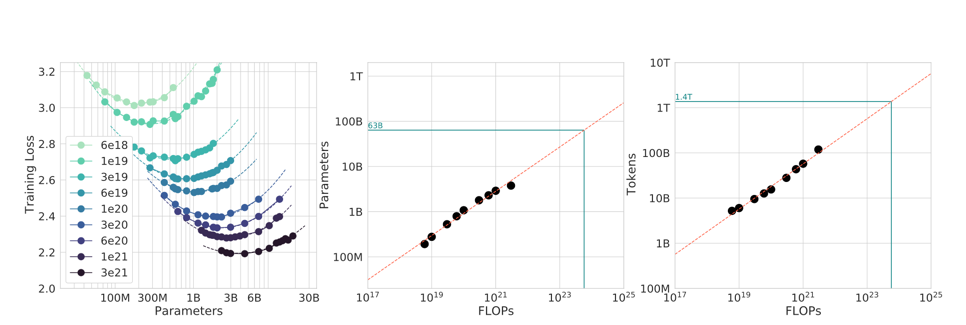

# GPT 2

The project is intended to be a minimal working implementation 
of a decoder only transformer model for text generation. 
The core architecture is based on the GPT-2 model by OpenAI, and 
some variations are proposed 

The model is trained on a large corpus of text data and is able to generate text sequences. The model is trained using a causal language modeling objective.

## Model Architecture choice and motivations
As shown in the paper: [Training Compute-Optimal Large Language Models](https://arxiv.org/abs/2203.15556)
from which the below figure is taken, having a fixed compute budget, 
it is possible to find the optimal model size in order to maximize the performance of the model
(left side of the figure)

Extrapolating the trend represented in the figure in the center, 
and knowing we will be training this model on an M1 MAX GPU for three hours 
(equivalent to roughly 10^17 Flops), we can estimate the optimal 
model size to be around 20 million parameters.

Analogously, from the right side of the figure, we know that we will need 
less than a billion tokens in order to reach the optimal performance. 

Since the english version of wikipedia is about 8 gigabytes, 
we are satisfied with the size of the dataset and can start training

**Quick Recap:**

- Available Compute : 10^17 Flops (~3 hrs on M1 MAX GPU)

- Optimal Parameters Count : 20 Million

- Training Data Required: <10^9 tokens

### Tokenizer

For the tokenizer (and only the tokenizer), we decided to use 
the OpenAI GPT-2 tokenizer, available on Hugging Face.
This was done for two reasons:
1)To avoid the shortcomings of building a custom tokenizer from scratch 
(as can be read in the [GPT2 paper](https://d4mucfpksywv.cloudfront.net/better-language-models/language_models_are_unsupervised_multitask_learners.pdf))
2)To spend more time focusing on the model architecture and training process
avoid the shortcomings of building a custom tokenizer from scratch

### Positional Embedding

The model uses the positional embedding of the 
[original transformer paper](https://arxiv.org/abs/1706.03762)

### Attention Mechanism

The model uses the standard scaled dot product attention mechanism, with multiple heads

### MLP
The model uses a simple feedforward neural network with a single hidden layer
and a ReLU activation function